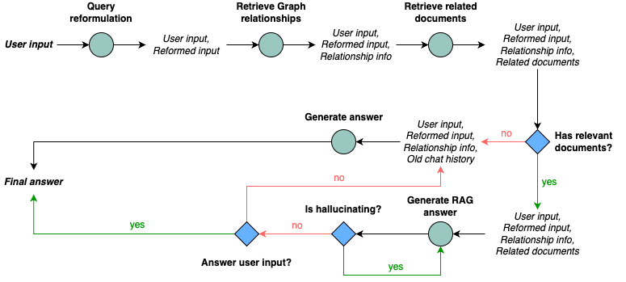

# HRAG

A FastAPI implementation of Hybrid Retrieval Augmented Generation with Neo4j as the graph database backend,
PGVector for vector store, and various LLM providers like Ollama and OpenAI.

The backend API service is created using [LangGraph](https://langchain-ai.github.io/langgraph/)

Features:

- Multi tenancy
- Self reflection when generating answer
- VectorStore embeddings with PGVector
- GraphGrag with Neo4j
- Document Reranking upon retrieval
- Have question reforming feature to make a standalone question before querying the database
- Have chat history and chat summary for long term memory

Workflow to generate answer:



## TODO

- [ ] Improve QUESTION REFORMATION prompt. Sometimes it produces weird result.
- [ ] Add more LLM providers (currently only support Ollama and OpenAI)
- [ ] Add background task to process document
- [ ] Separate LLM model and Embeddings model (Currently use the same provider for both)
- [ ] Add unit tests
- [ ] Create a simple UI for testing
- [ ] Add search tool for querying unknown knowledge before generating regular answer
- [ ] Authentication

## Running service on local

### Prerequisites

Docker desktop instance. Please install it from [here](https://www.docker.com/products/docker-desktop/).

Use [Ollama](https://ollama.com/) if you want a fully local service. My go to llm models are

- embedding: `nomic-embed-text:latest`
- llm: `llama3.1:8b` or `mistral-nemo:latest`

Clone the project

```bash
git clone git@github.com:tuannha/HRAG.git
```

### Starting the service

- Check the environment parameters in `docker-compose.yaml`

- Run

```bash
docker compose up -d
```

- Visit http://localhost:8000/api/v1/docs to see the available endpoints

- API Playground:

  - Create a tenant with http://localhost:8000/api/v1/docs#/tenant/create_tenant_tenants__post

  - Upload documents with http://localhost:8000/api/v1/docs#/documents/add_document_tenants__tenant__documents__post

  - Start chatting with http://localhost:8000/api/v1/docs#/conversations/generate_response_tenants__tenant__conversations__post

## Contribution

Contributions are welcome! Please open an issue or submit a pull request for any improvements, bug fixes, or new features you would like to add.

## License

MIT License

## References

- https://www.youtube.com/watch?v=-ROS6gfYIts (Reliable, fully local RAG agents with LLaMA3)
- https://neo4j.com/developer-blog/enhance-rag-knowledge-graph/ (Enhancing the Accuracy of RAG Applications With Knowledge Graphs)
- https://python.langchain.com/v0.2/docs/integrations/retrievers/flashrank-reranker/ (flashrank)
